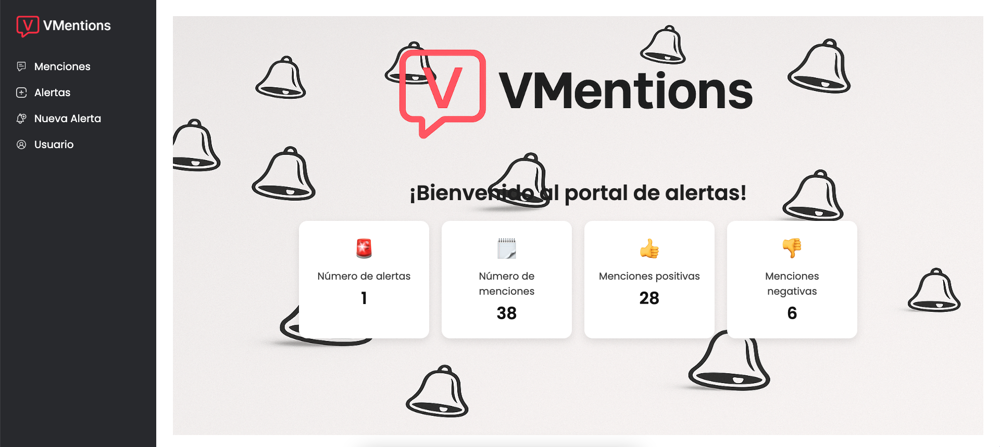
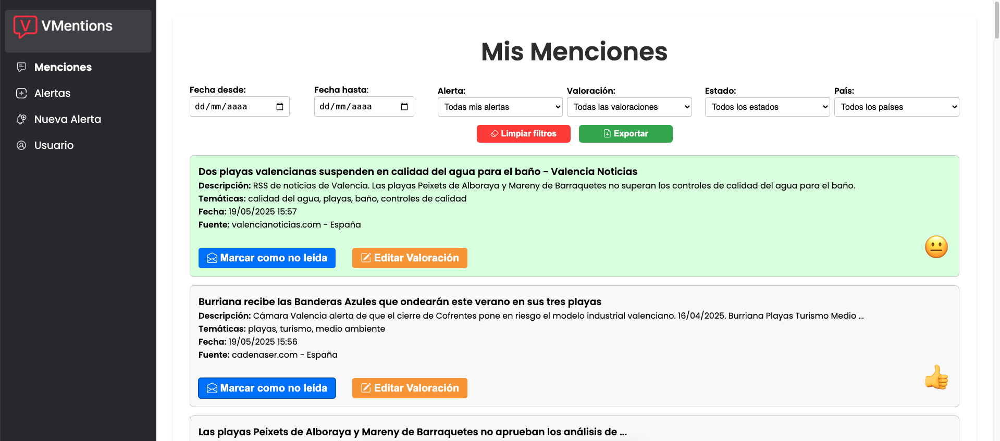

<p align="center">
  <a href="https://vuejs.org/"></a>
  <a href="https://vitejs.dev/"></a>
  <a href="https://tailwindcss.com/"></a>
</p>

# 🧠 VMentions - Frontend


> 🌐 **Interfaz moderna para visualizar y gestionar menciones.**  
> Frontend desarrollado en Vue 3 + Vite con diseño responsive y funciones de exportación, filtrado y visualización.

---

## ⚙️ ¿Qué ofrece el frontend?

- 📊 Tabla dinámica con scroll y filtros
- 📤 Exportación a Excel o CSV
- 🔍 Buscador por campos
- 🧠 Visualización de sentimiento y temática procesados por IA
- 🔐 Gestión de sesiones y autenticación

---

## 📦 Estructura del proyecto

```
📂 v_mentions_frontend/
├── public/
│   └── index.html
├── src/
│   ├── assets/
│   ├── components/
│   │   └── AppMessages.vue
│   ├── views/
│   │   ├── LoginView.vue
│   │   ├── AlertasView.vue
│   │   ├── AnadirAlerta.vue
│   │   ├── AnadirAlertaForm.vue
│   │   ├── AnadirCliente.vue
│   │   ├── CambiarSentimiento.vue
│   │   ├── ClientesView.vue
│   │   ├── MencionesView.vue
│   │   ├── UsuarioView.vue
│   │   └── WelcomeView.vue
│   ├── router/
│   │   └── index.js
│   ├── store/
│   │   └── index.js
│   ├── App.vue
│   └── main.js
├── .env
├── .gitignore
├── index.html
├── package.json
├── vite.config.js
└── README.md

```

---

## 🚀 ¿Cómo arrancarlo?

```bash
# Clona el repositorio
git clone https://github.com/dalpe23/v_mentions_frontend.git

# Instala dependencias
npm install

# Ejecuta en modo desarrollo
npm run dev

# Compila para producción
npm run build
```

---

## ✨ Características

| Ventajas de VMentions Frontend |
|--------------------------------|
| ✅ Interfaz moderna responsive  |
| ✅ Filtros, búsqueda y exportación |
| ✅ Integración con backend IA |
| ✅ Rápido y ligero con Vite     |

---

## 🖼️ Vista de la aplicación

### 📊 Dashboard


### 🧠 Mis menciones


## 🧪 Backend en Laravel

El backend de este proyecto se encuentra en el siguiente repositorio:

👉 [**v_mentions_backend**](https://github.com/dalpe23/v_mentions_backend)

---

## 📫 Contacto

Creado con ❤️ por [dalpe23](https://github.com/dalpe23)

[](https://www.linkedin.com/in/daniel-alemany-p%C3%A9rez-256b57354/)

---

> ℹ️ ¿Ideas o mejoras? ¡Abre un issue o haz un pull request!

---

# 🧠 VMentions - Frontend (English)

> 🌐 **Modern interface to view and manage mentions.**  
> Frontend developed in Vue 3 + Vite with responsive design, filters, and export tools.

---

## ⚙️ What does the frontend offer?

- 📊 Dynamic table with scroll and filters
- 📤 Export to Excel or CSV
- 🔍 Search by fields
- 🧠 Visualization of AI-processed sentiment and topic
- 🔐 Session management and login

---

## 📦 Project structure

```
📂 v_mentions_frontend/
├── public/
│   └── index.html
├── src/
│   ├── assets/
│   ├── components/
│   │   └── AppMessages.vue
│   ├── views/
│   │   ├── LoginView.vue
│   │   ├── AlertasView.vue
│   │   ├── AnadirAlerta.vue
│   │   ├── AnadirAlertaForm.vue
│   │   ├── AnadirCliente.vue
│   │   ├── CambiarSentimiento.vue
│   │   ├── ClientesView.vue
│   │   ├── MencionesView.vue
│   │   ├── UsuarioView.vue
│   │   └── WelcomeView.vue
│   ├── router/
│   │   └── index.js
│   ├── store/
│   │   └── index.js
│   ├── App.vue
│   └── main.js
├── .env
├── .gitignore
├── index.html
├── package.json
├── vite.config.js
└── README.md
```

---

## 🚀 How to run it?

```bash
# Clone the repository
git clone https://github.com/dalpe23/v_mentions_frontend.git

# Install dependencies
npm install

# Run in development mode
npm run dev

# Build for production
npm run build
```

---

## ✨ Key features

| VMentions Frontend Benefits |
|-----------------------------|
| ✅ Modern responsive UI      |
| ✅ Filters, search, export   |
| ✅ Backend AI integration    |
| ✅ Fast and lightweight with Vite |

---
## 🖼️ App view

### 📊 Dashboard


### 🧠 My mentions


## 🧪 Backend in Laravel

The backend of this project can be found in the following repository:

👉 [**v_mentions_backend**](https://github.com/dalpe23/v_mentions_backend)


## 📫 Contact

Made with ❤️ by [dalpe23](https://github.com/dalpe23)

[](https://www.linkedin.com/in/daniel-alemany-p%C3%A9rez-256b57354/)

---

> ℹ️ Ideas or improvements? Open an issue or submit a pull request!
